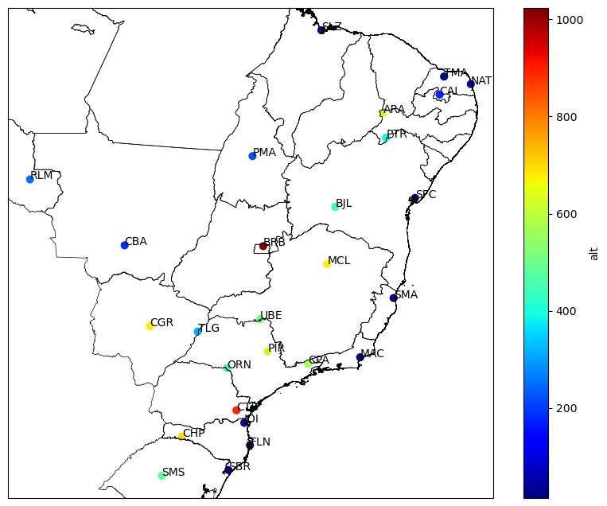
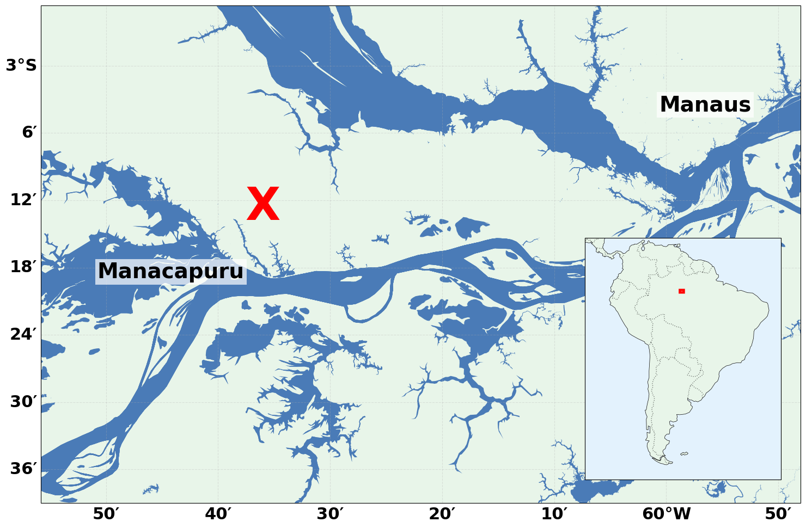

# Simple maps in python

Plot simple maps using Cartopy and CSV file with georreferenced data. More informations at https://www.monolitonimbus.com.br/plotar-mapas-no-python

## How to use

To run this script, you will need to have Python 3 and Conda (Anaconda or Miniconda) installed. The necessary libraries can be installed via `conda-forge`:

```bash
# 1. Create a dedicated Conda environment (recommended)
conda create -n maps -c conda-forge osmnx matplotlib cartopy

# 2. Activate the environment
conda activate maps

# 3. Clone the Repository
git clone https://github.com/viniroger/plot_map
cd plot_map
```

## A. `plot_map.py`: Station Data Plotter

This script is designed to plot geographical data points (e.g., weather stations) from a CSV file onto a map, including administrative boundaries and a color-coded representation of a chosen variable. Features:

-   **CSV Data Input**: Reads station data (longitude, latitude, ID, and a main variable) from a specified CSV file.
-   **Administrative Boundaries**: Adds political contours from a ESRI Shapefile (`.shp`) for geographical context.
-   **Station Annotations**: Plots station IDs at their respective coordinates.
-   **Color-coded Data**: Visualizes a chosen numerical variable (e.g., altitude) using a color gradient and a colorbar.

1.  **Prepare Data and Shapefile**:
    A CSV file named `info_est.csv` containing at least `lon`, `lat`, `id`, and a numerical column (e.g., `alt`). A shapefile for administrative boundaries (e.g., `BRA_adm1.shp`) placed in a subdirectory named `shp` (i.e., `shp/BRA_adm1.shp`).

2.  **Configure Variables (Optional)**:
    Open `plot_map.py` and adjust the `main_var` if your CSV's main data column is named differently than `alt` (altitude).

    ```python
    # Variable to plot from CSV
    main_var = 'alt'

    # Input CSV filename
    file_in = 'info_est.csv'

    # Shapefile path (e.g., for Brazil admin level 1)
    feat_file = 'shp/BRA_adm1'

    # Output image filename
    file_out = f'map_{main_var}.png'
    ```

3.  **Execute the Script**:
    With the `mapas` Conda environment activated, run the script from your terminal:

    ```bash
    python plot_map.py
    ```

    The script will generate an image file (e.g., `map_alt.png`) in your working directory.



### B. `hydro_map.py`: Hydrology Map Generator

This script generates simplified hydrology maps for any region, focusing solely on water bodies from OpenStreetMap data. It's ideal for clean visualizations of rivers, lakes, and reservoirs, with customizable markers, text annotations, and a contextual locator map. Features:

-   **Data Extraction**: Fetches water body data (rivers, lakes, reservoirs) directly from OpenStreetMap (OSM) via the `OSMnx` library.
-   **Simplified Visualization**: Renders maps with water bodies against a light green background, omitting topography for a clear focus on hydrology.
-   **Custom Annotations**: Allows adding custom markers (e.g., a red 'X') and text labels (e.g., city names) at specific geographic coordinates.
-   **Enhanced Readability**: Extra-large font sizes for axes and text ensure clarity.
-   **Geographical Context**: Includes a South America locator map in the bottom-right corner, with a rectangle highlighting the main map's study area for easy geographical orientation.

1.  **Define the Area of Interest (Bounding Box)**:
    Open `hydro_map.py` and locate the `bbox` variable. Adjust the `[south, north, west, east]` coordinates for your desired region. For Central Amazonia, for example:

    ```python
    bbox = [-3.65, -2.91, -60.93, -59.80] # Example: Central Amazonia
    ```

2.  **Adjust Markers and Text (Optional)**:
    Within the `create_hydro_map_v5` function, you can modify the coordinates, content, and style of markers and text labels:

    ```python
    # Example of a large red 'X' marker
    ax.text(-60.6, -3.21, 'X', color='red', fontsize=60, fontweight='bold', 
            ha='center', va='center', transform=ccrs.PlateCarree())

    # Example of 'Manacapuru' text label
    ax.text(-60.627429, -3.290918, 'Manacapuru', color='black', fontsize=28, 
            fontweight='bold', ha='right', va='top', transform=ccrs.PlateCarree(),
            bbox=dict(facecolor='white', alpha=0.7, edgecolor='none', pad=3))
    ```

3.  **Execute the Script**:
    With the Conda environment activated, run the script from your terminal:

    ```bash
    python hydro_map.py
    ```

    The script will download hydrology data from OSM and generate an image file (`map_hydro.png`) in the same directory.


